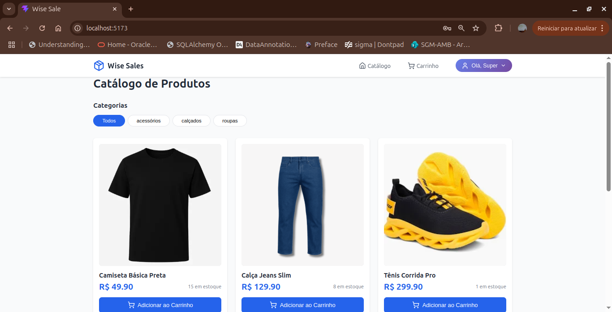
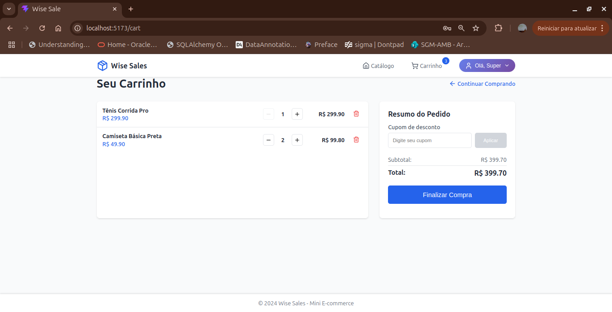
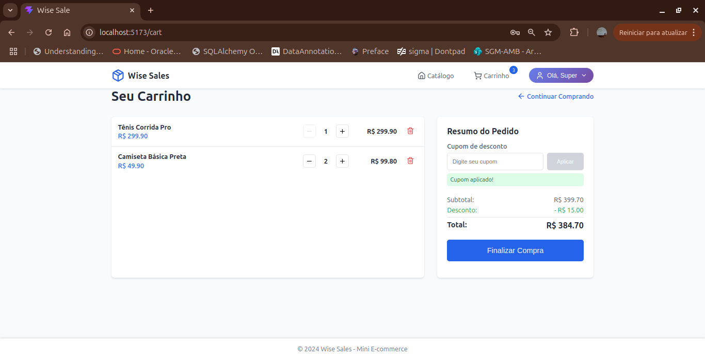
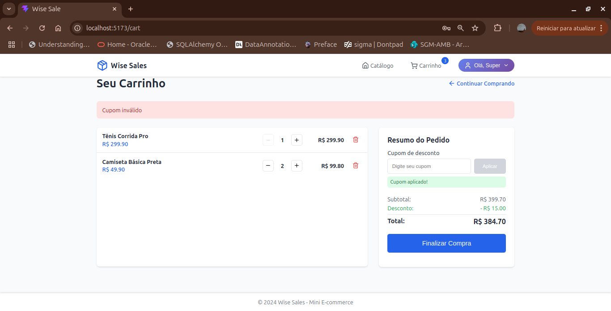
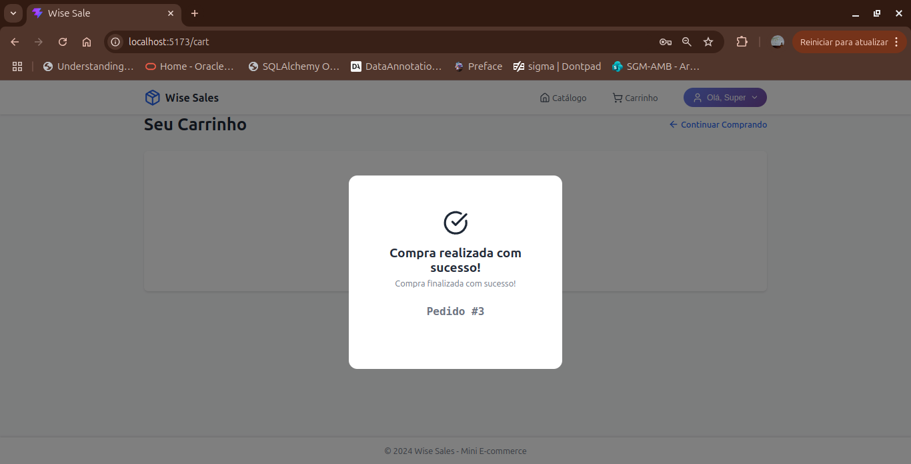
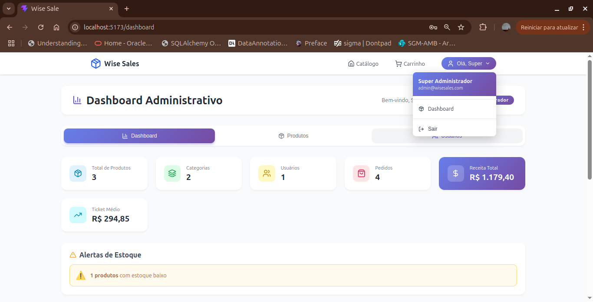
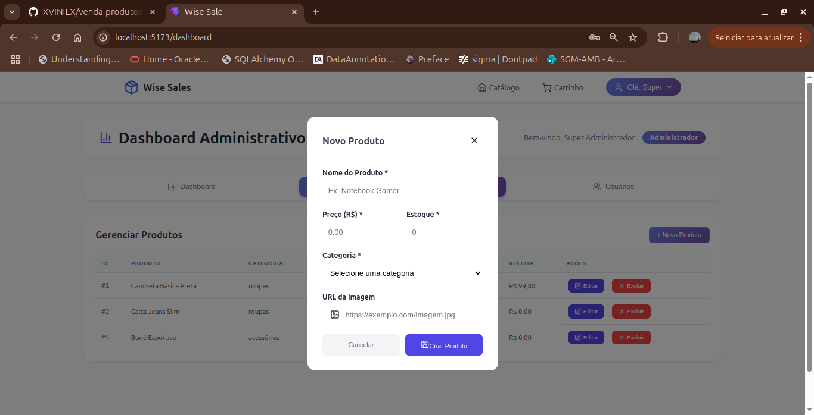

Backend Wise Sales - Guia de Execução com Docker
📋 Pré-requisitos
Docker (versão 20.10+)

Docker Compose (versão 2.0+)

Python 3.11+ (apenas para desenvolvimento local)

Git

📦 Estrutura do Projeto
text
teste-fullstack-python-react-wisesales/
├── backend/
│ ├── src/
│ │ ├── routes/
│ │ ├── services/
│ │ ├── repositories/
│ │ ├── models/
│ │ └── main.py
│ ├── alembic/
│ ├── requirements.txt
│ └── Dockerfile
├── docker-compose.yml
├── seed.sql
└── .env.example

## 🚀 Passo a Passo para Executar o Backend com Docker

1. Clone o repositório
   bash
   git clone https://github.com/xvinilx/teste-fullstack-python-react-wisesales.git
   cd teste-fullstack-python-react-wisesales
2. Configure as variáveis de ambiente
   bash

# Copie o arquivo de exemplo

cp .env.example ./backend/.env

# Edite o arquivo .env com suas configurações (opcional)

nano .env
Conteúdo do .env.example:

env

# Database

DB_HOST=db
DB_PORT=5432
DB_NAME=wisesales
DB_USER=wisesales
DB_PASSWORD=wisesales123

# JWT

SECRET_KEY=your-secret-key-here-change-in-production
ALGORITHM=HS256
ACCESS_TOKEN_EXPIRE_MINUTES=30

# Environment

ENVIRONMENT=development
DEBUG=True 3. Inicie os containers com Docker Compose
bash

# Usuário SuperAdmin

SUPER_ADMIN_EMAIL=admin@wisesales.com
SUPER_ADMIN_PASSWORD=Admin@123456

# Subir os containers em background

docker-compose up -d

# Verificar se os containers estão rodando

docker-compose ps

5. Acesse a API
   API: http://localhost:8000

Documentação Swagger: http://localhost:8000/docs

Documentação ReDoc: http://localhost:8000/redoc

6 - Acesse o Front
http://localhost:5173

7 - Rodando os testes
No container do backend, rode: pytest

## 📸 Screenshots

### Página Inicial

### Carrinho de Compras

### Compra Realizada

### DASHBOARD ADMIN

